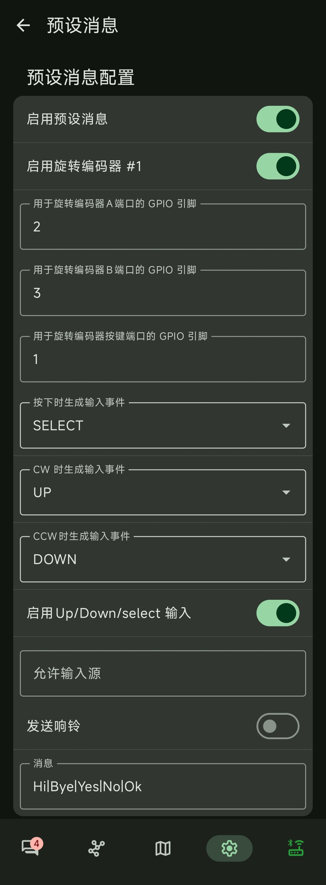

# MeshSlide - 适用于 Heltec V4 的模块化 Meshtastic 外壳

该打印套件适用于 Heltec V4

## 特性

MeshSlide 是一款模块化 Meshtastic 外壳, 专为 Heltec V4 设计. 采用滑入式 pogopin 导轨, 支持热插拔扩展

目前已为 MeshSlide 设计出 4 个扩展模块: 

- SlideZero - 带挂绳孔的导轨触点保护模块, 无任何功能
- SlideRotary - 基于 EC11 的旋钮模块
- SlideTriple - 基于 Kailh/Gateron 矮轴的按键模块
- SlideKB - 基于 CardKB 的全键盘输入模块

### SlideZero

占位保护模块

- 主要用于遮盖保护导轨与 pogopin 触点
- 包含一个挂绳孔, 可以通过切换滑入方向调整挂绳孔的位置

### SlideRotary

基于 EC11 旋转编码器的旋钮模块

- 顺时针/逆时针旋转滚动 + 按下确认
- 用于菜单导航, 预设消息选择

### SlideTriple

基于 Kailh/Gateron 矮轴的按键模块

- 从上至下依次为 上, 下, 确认
- 用于菜单导航, 预设消息选择

### SlideKB

基于 CardKB 的全键盘输入模块

- 使用键盘实现完整的文本输入
- 带可调节支架, 可切换手持/桌面模式
- 内部预留 76mm x 46mm x 5mm 的安装/走线空间, 可用于放置额外的传感器

## MeshSlide

### BOM 清单

该清单包含 MeshSlide 与 SlideZero

1. 3D 打印外壳 S1
2. 3D 打印外壳 R1
3. 3D 打印外壳 M1
4. 3D 打印外壳 U1
5. 3D 打印外壳 L1
6. 3D 打印外壳 S2
7. 胶棒天线
8. 3D 打印外壳 ZS 2 个
9. 3D 打印外壳 ZM
10. 3D 打印外壳 B1 2 个
11. Heltec V4, 带 L76K GNSS 模块
12. pogopin 磁吸连接器 8P 母座
13. 电池 (尺寸 4.6mm x 22mm x 76mm)
14. IPEX 转 SMA 内孔转接线, 线长 5cm 1 个
15. 紧固件
    1. 内六角圆柱头螺栓 M2x7 10 个
    2. 内六角圆柱头螺栓 M2x5 1 个
    3. 内六角扁平头螺栓 M2x4 1 个
    4. M2x5 双通铜柱滚花螺母, 外径 3mm, 3 个 

pogopin 8P 磁吸连接器具体尺寸如下图所示

### 组装说明

#### MeshSlide

将 pogopin 的引脚焊接至 Heltec V4, 焊接引脚如图所示, 从左至右依次为 GND, 18(SCL), 17(SDA), 1, 2, 3, 4, 3V3, 所有的扩展模块均基于此定义

将 M2x5 滚花螺母嵌入打印外壳 M1 与 S1

将 SMA 转接线安装至打印外壳 S1, 并将 SMA 转接线连接到 Heltec V4 上, 将 Heltec v4 与 L76K GNSS 模块安装至打印外壳 M1

将电池与 Heltec V4 连接, 确保不破损的前提下尽可能弯折线缆

安装打印外壳 L1, 安装打印外壳 B1, 打印外壳 L1 最大能容纳尺寸 5mm x 24mm x 82mm 的电池

将 pogopin 嵌入打印外壳 S2, 将打印外壳 S2 安装至打印外壳 M1

安装打印外壳 U1

安装打印外壳 R1

安装内六角圆柱头螺栓 M2x7 6 个

安装内六角圆柱头螺栓 M2x5 1 个

安装内六角扁平头螺栓 M2x4 1 个

安装胶棒天线

组装完成

#### SlideZero

使用 4 个内六角圆柱头螺栓 M2x7 组装打印外壳 ZS 与 ZM

组装完成

将 SlideZero 滑入 MeshSlide

## SlideRotary

### BOM 清单

1. 3D 打印外壳 S1
2. 3D 打印外壳 S2
3. 3D 打印外壳 M1
4. 3D 打印外壳 C1
5. 3D 打印外壳 U1
6. pogopin 磁吸连接器 8P 公座
7. EC11 旋转编码器 15mm
8. 内六角圆柱头螺栓 M2x7 4 个

### 组装说明

将 pogopin 的引脚焊接至 EC11, 焊接引脚如图所示, 在焊接前请务必与 MeshSlide 吸附测试 pogopin 的磁铁极性

将 pogopin 嵌入 3D 打印外壳 C1, 如果嵌入时 pogopin 松动可以使用胶水粘死

将 EC11 安装至 3D 打印外壳 M1

将 3D 打印外壳 C1 安装至 3D 打印外壳 M1

使用 4 个 M2x7 内六角圆柱头螺栓将 3D 打印外壳 S1 与 S2 固定至 3D 打印外壳 M1

旋紧 EC11 的螺母

将 3D 打印外壳 U1 安装至 EC11

组装完成

将 SlideRotary 滑入 MeshSlide

## SlideTriple

### BOM 清单

1. 3D 打印外壳 S1 2 个
2. 3D 打印外壳 M1
3. 3D 打印外壳 C1
4. 内六角圆柱头螺栓 M2x7 4 个
5. 内六角圆柱头螺栓 M2x5 1 个
6. pogopin 磁吸连接器 8P 公座
7. Kailh/Gateron 矮轴 3 个
8. 键帽 3 个

### 组装说明

将 pogopin 的引脚焊接至 3 个矮轴, 焊接引脚如图所示, 从左至右依次为 GND, 留空, 留空, 1, 2, 3, 留空, 留空, 在焊接前请务必与 MeshSlide 吸附测试 pogopin 的磁铁极性

将 3 个矮轴安装至 3D 打印外壳 M1

将 pogopin 嵌入 3D 打印外壳 C1, 如果嵌入时 pogopin 松动可以使用胶水粘死

将 3D 打印外壳 C1 安装至 3D 打印外壳 M1

使用 4 个 M2x7 内六角圆柱头螺栓将 2 个 3D 打印外壳 S1 固定至 3D 打印外壳 M1

使用 1 个 M2x5 内六角圆柱头螺栓固定 3D 打印外壳 M1

组装完成

将 SlideTriple 滑入 MeshSlide

## SlideKB

### BOM 清单

1. 3D 打印外壳 S1
2. 3D 打印外壳 C1
3. 3D 打印外壳 K1
4. 3D 打印外壳 K2
5. 3D 打印外壳 L1
6. 3D 打印外壳 U1
7. 3D 打印外壳 D1
8. M5Stack CardKB
9. GROVE 连接线 HY2.0-4Pin
10. pogopin 磁吸连接器 8P 公座
11. 内六角圆柱头螺栓 M2x7 6 个
12. 内六角扁平头螺栓 M2x4 2 个

### 组装说明

将 pogopin 的引脚焊接至 GROVE 线, 焊接引脚如图所示, 从左至右依次为 GND, SCL, SDA, 留空, 留空, 留空, 留空, 3V3, 在焊接前请务必与 MeshSlide 吸附测试 pogopin 的磁铁极性

请注意, 图示的 GROVE 线的颜色与 M5Stack CardKB 官方附带的 Grove 线颜色并不一致, 请仔细确认再焊接

将 pogopin 嵌入 3D 打印外壳 C1, 如果嵌入时 pogopin 松动可以使用胶水粘死; 将 GROVE 线连接至 M5Stack CardKB, 将 CardKB 安装至 3D 打印外壳 L1

3D 打印外壳 L1 底部留出了约 76mm x 46mm x 5mm 的空间和走线空间, 可以容纳符合尺寸的其他传感器

安装 3D 打印外壳 K1, K2

使用 2 个内六角圆柱头螺栓 M2x7 安装 3D 打印外壳 U1

使用 4 个内六角圆柱头螺栓 M2x7 安装 3D 打印外壳 S1

使用 2 个 内六角扁平头螺栓 M2x4 安装 3D 打印外壳 D1

组装完成

将 SlideKB 滑入 MeshSlide

展开支架

## 软件配置

